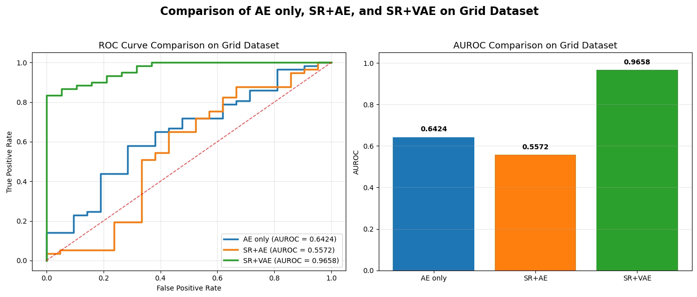
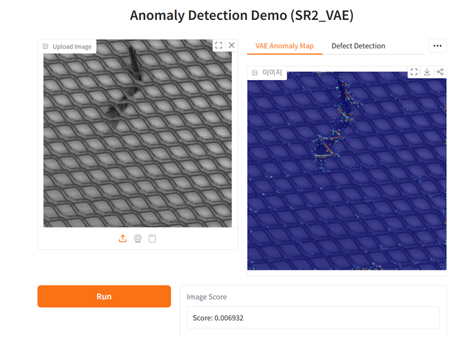
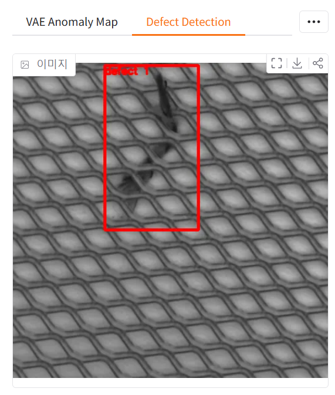
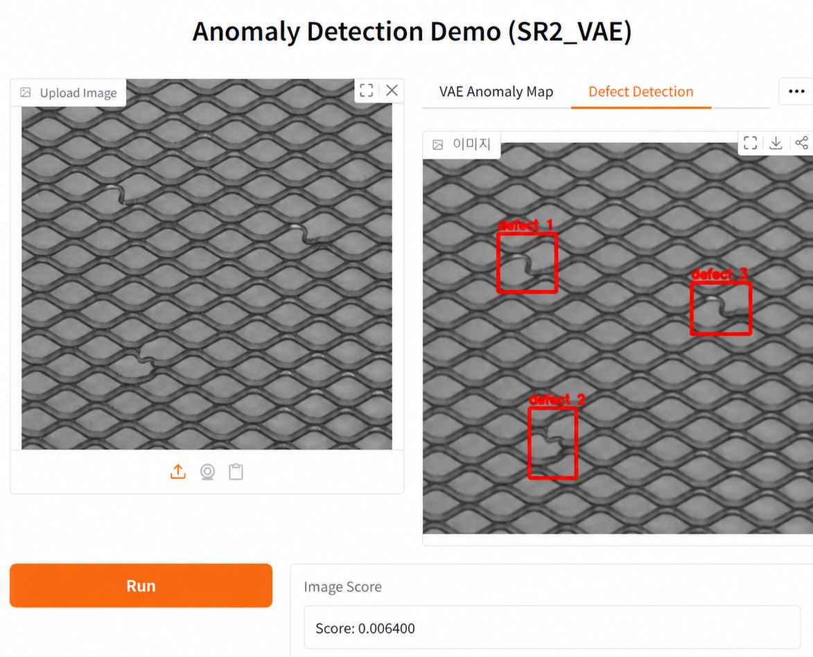
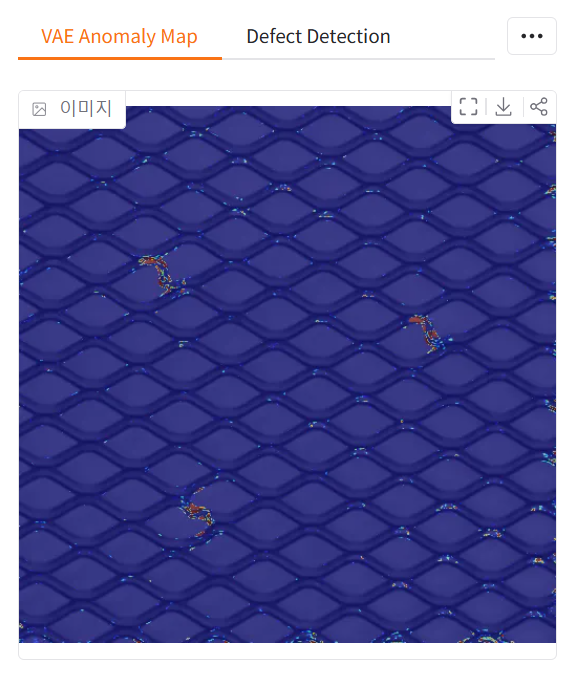
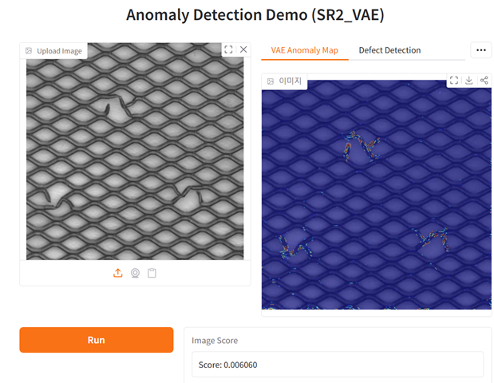
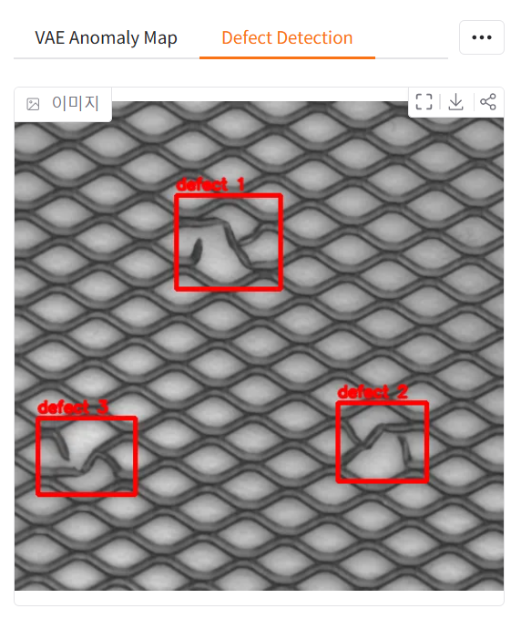

# Super-Resolution Based Anomaly Detection

본 프로젝트는 Grid Dataset을 대상으로 **AE only, SR+AE, SR+VAE** 기반 이상탐지 성능을 비교한 실험입니다.

저해상도 또는 시각적으로 품질이 낮은 이미지에서 이상 영역을 더 명확하게 탐지하기 위해,  
초해상도 기반 전처리와 복원 기반 이상탐지 모델을 결합했습니다.

---

## 1. Project Overview

본 프로젝트에서는 정상 이미지로 학습한 복원 기반 모델을 사용하여 입력 이미지의 이상 여부를 판단했습니다.

비교한 방식은 다음과 같습니다.

| Method | Description |
|---|---|
| AE only | AutoEncoder 기반 복원 오차 이상탐지 |
| SR+AE | Super-Resolution 적용 후 AutoEncoder 복원 기반 이상탐지 |
| SR+VAE | Super-Resolution 적용 후 VAE 복원 기반 이상탐지 |

이상탐지는 입력 이미지와 복원 이미지 간의 차이를 기반으로 수행했으며,  
복원 오차가 큰 영역을 anomaly map으로 시각화했습니다.

---

## 2. Experiment Result

Grid Dataset 기준으로 AE only, SR+AE, SR+VAE의 AUROC를 비교했습니다.

| Method | AUROC |
|---|---:|
| AE only | 0.6424 |
| SR+AE | 0.5572 |
| SR+VAE | 0.9658 |

실험 결과, **SR+VAE가 AUROC 0.9658로 가장 높은 성능**을 보였습니다.  
이를 통해 본 실험에서는 초해상도 전처리와 VAE 기반 복원 방식을 결합했을 때 Grid Dataset의 이상 영역을 가장 효과적으로 구분할 수 있음을 확인했습니다.

---

## 3. Demo: SR+VAE Anomaly Detection

Gradio 기반 데모 웹을 구현하여 test image에 대한 이상탐지 결과를 시각화했습니다.

데모에서는 다음 항목을 확인할 수 있습니다.

- 입력 test image
- VAE anomaly map
- defect candidate region
- image-level anomaly score

<table>
  <tr>
    <td align="center">
      
       
    </td>
    <td align="center">
      
       
    </td>
  </tr>
</table>

---

## 4. Visualization Examples

### 4.1 VAE Anomaly Map

SR 이미지와 VAE 복원 이미지 간의 reconstruction error를 기반으로 anomaly map을 생성했습니다.  
밝게 표시되는 영역일수록 복원 오차가 큰 영역을 의미합니다.

<table>
  <tr>
    <td align="center">
      
       
    </td>
    <td align="center">
      
       
    </td>
  </tr>
</table>

---

### 4.2 Defect Candidate Detection

Anomaly map을 기반으로 후처리를 수행하여 결함 후보 영역을 bounding box 형태로 시각화했습니다.

여러 개의 defect candidate가 존재하는 경우, 각 후보 영역을 별도로 표시했습니다.

후처리 결과를 바탕으로 주요 defect candidate를 시각적으로 확인할 수 있습니다.

<table>
  <tr>
    <td align="center">
      
       
    </td>
    <td align="center">
      
       
    </td>
  </tr>
</table>
